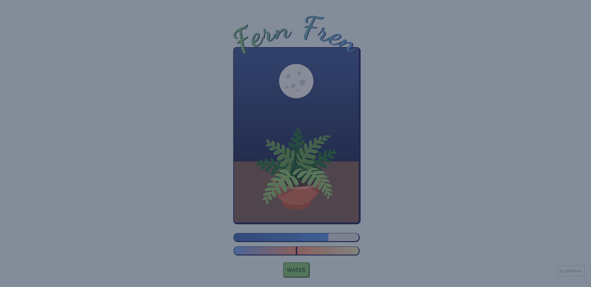

# 🌿 Fern Fren

**Fern Fren** is a cozy, browser-based plant care simulator.

Care for your fern by balancing **water** and **sunlight**, and watch it subtly
react to its environment throughout the day.



## 🌱 Features

- ☀️ **Day / Night Cycle**
  - Toggle between day and night (by clicking on the celestial body)
  - Sunlight increases during the day and decreases at night
  - Plant becomes more sepia or grayscale based on sunlight

- 💧 **Water System**
  - Thirst decreases over time
  - Visual feedback indicates when your plant needs water
  - Watering restores hydration

- 🎨 **Cozy UI**
  - Cozy-game-inspired typography
  - Soft gradients and rounded elements
  - Calm animations and transitions

## 🛠 Technologies

- `HTML5`
- `CSS`
- `TypeScript`

## 🔮 Live Demo

Open in **[GitHub Pages](https://bambiroe.github.io/fern-fren/)**

*OR*

**1.** Clone the repo:

```bash
git clone https://github.com/bambiroe/fern-fren.git
```

**2.** Navigate to the project directory:

```bash
cd fern-fren
```

**3.** Install dependencies (if you plan to run locally):

```bash
npm install
```

**4.** Run the app:

```bash
npx tsc && python3 -m http.server
```

**5.** Open your browser and visit `http://localhost:8000` to view the app.

## ✨ Author

Made with care by **[@bambiroe](https://github.com/bambiroe)**
